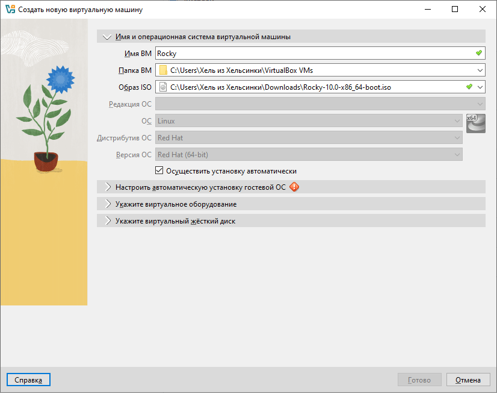
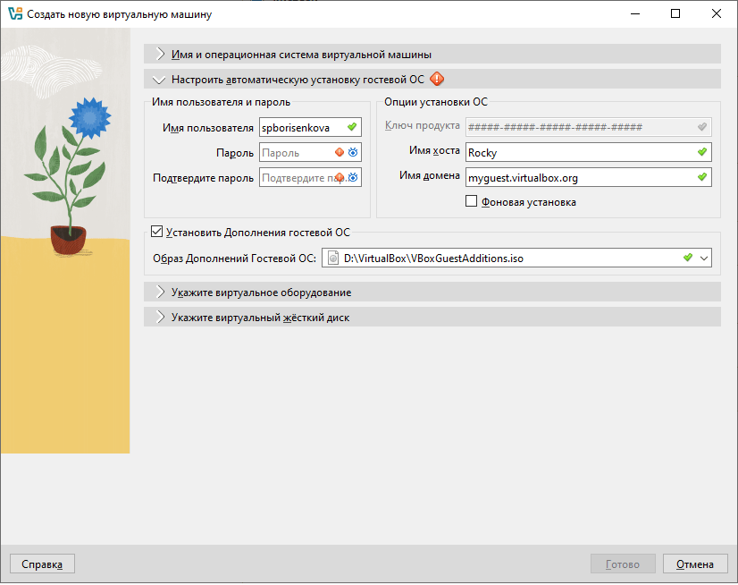
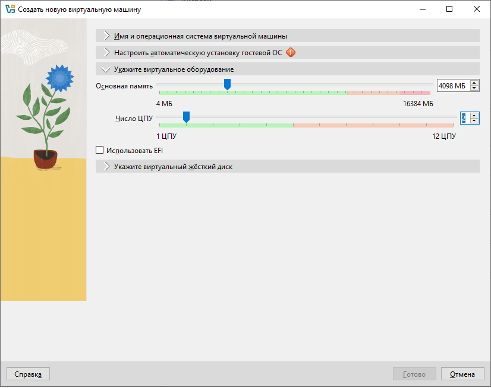
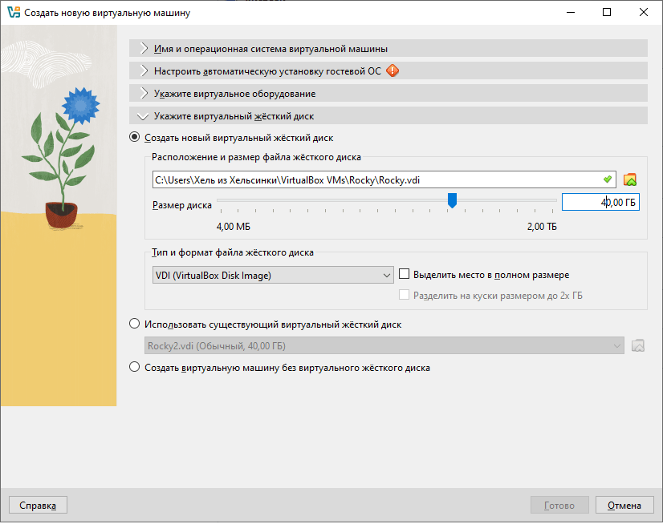
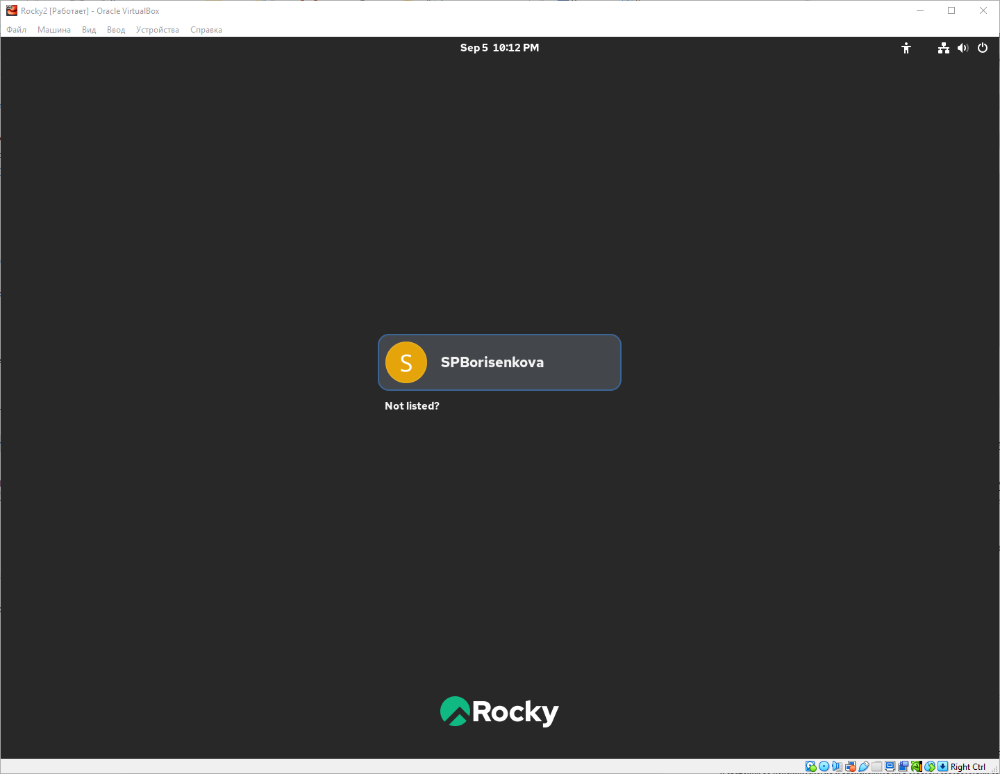

---
## Front matter
lang: ru-RU
title: Отчёт по лабораторной работе №1
subtitle: Установка и конфигурация ОС
author:
  - Борисенкова София Павловна
institute:
  - Российский университет дружбы народов, Москва, Россия
date: 1 сентября 2025

## i18n babel
babel-lang: russian
babel-otherlangs: english

## Formatting pdf
toc: false
slide_level: 2
aspectratio: 169
section-titles: true
theme: metropolis
header-includes:
 - \metroset{progressbar=frametitle,sectionpage=progressbar,numbering=fraction}
---

# Цели и задачи работы

## Цель работы

Приобретение практических навыков установки и конфигурации операционной системы на виртуальной машине.

# Ход выполнения работы

## Создание виртуальной машины

{ #fig:001 width=70% }

## Настройка пользователя

{ #fig:002 width=70% }

## Настройка составляющих

{ #fig:003 width=70% }

## Настройка жесткого диска

{ #fig:004 width=70% }

## Вход в систему

{ #fig:005 width=70% }

## Вывод

Выполнена установка операционной системы на виртуальную машину и её конфигурация.
