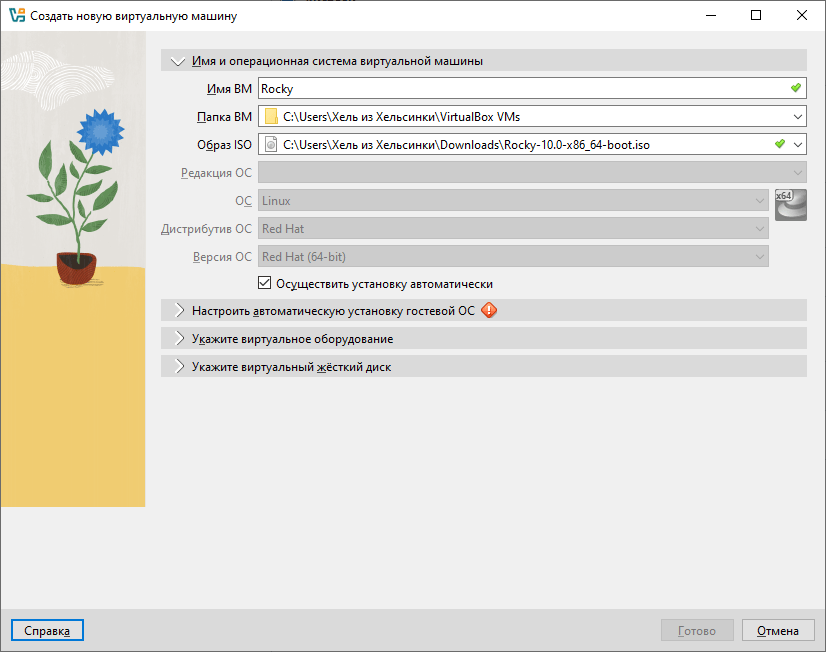
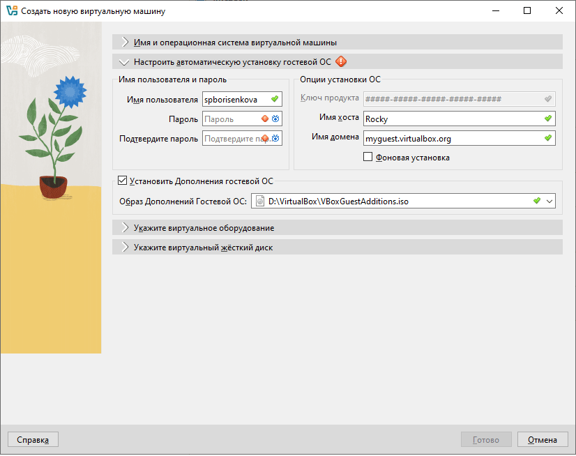
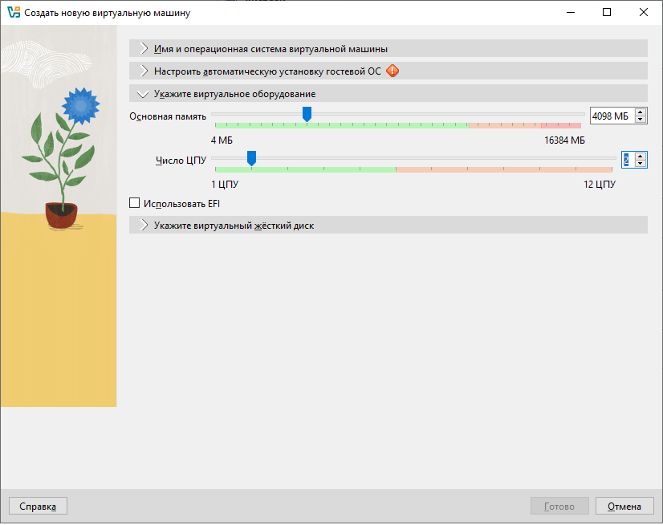
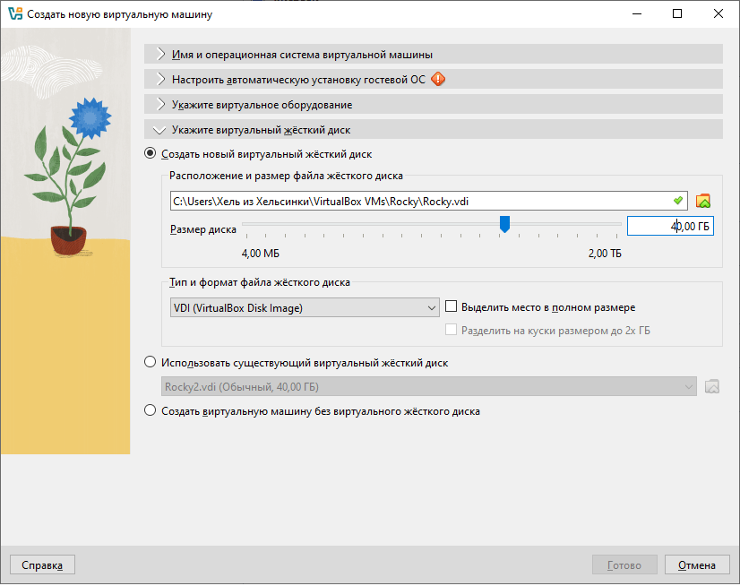
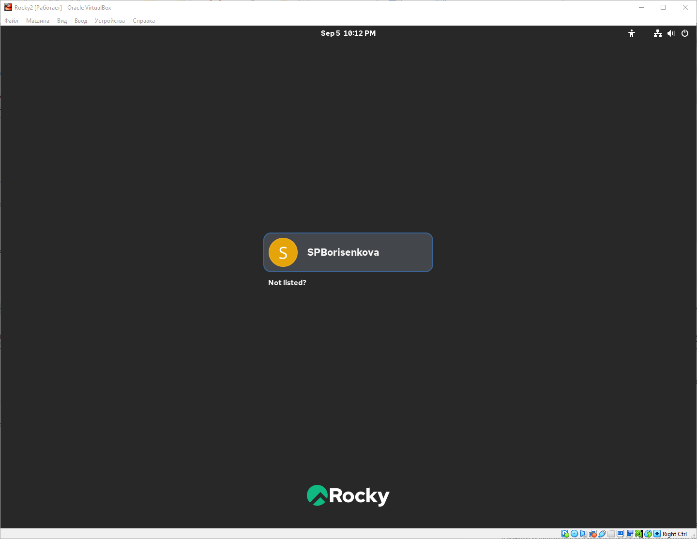
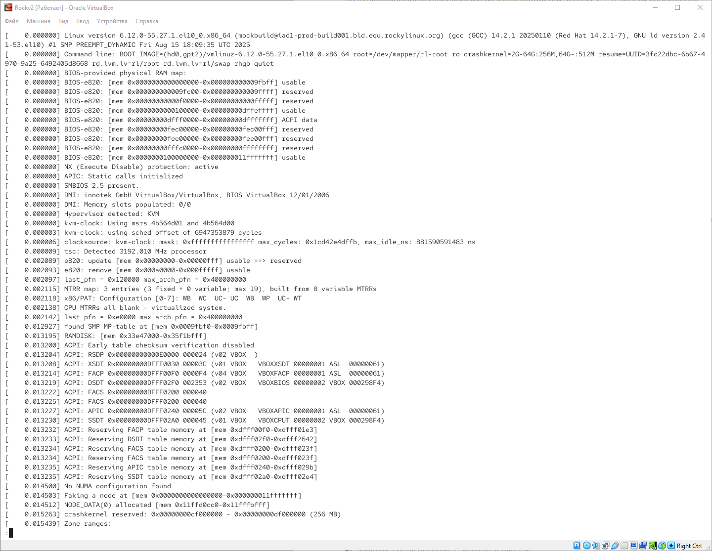
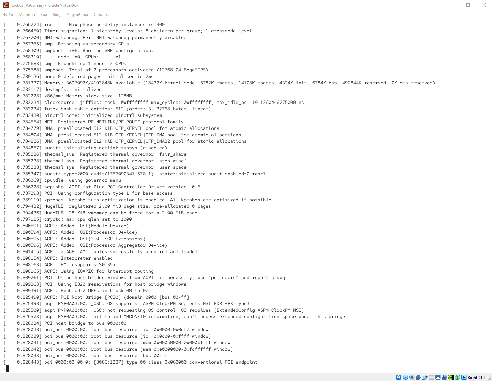

---
## Front matter
title: "Отчёт к лабораторной работе №1"
subtitle: "Основы администрирования операционных систем"
author: "Борисенкова София Павловна"

## Generic otions
lang: ru-RU
toc-title: "Содержание"

## Bibliography
bibliography: bib/cite.bib
csl: pandoc/csl/gost-r-7-0-5-2008-numeric.csl

## Pdf output format
toc: true # Table of contents
toc-depth: 2
lof: true # List of figures
lot: true # List of tables
fontsize: 12pt
linestretch: 1.5
papersize: a4
documentclass: scrreprt
## I18n polyglossia
polyglossia-lang:
  name: russian
  options:
	- spelling=modern
	- babelshorthands=true
polyglossia-otherlangs:
  name: english
## I18n babel
babel-lang: russian
babel-otherlangs: english
## Fonts
mainfont: PT Serif
romanfont: PT Serif
sansfont: PT Sans
monofont: PT Mono
mainfontoptions: Ligatures=TeX
romanfontoptions: Ligatures=TeX
sansfontoptions: Ligatures=TeX,Scale=MatchLowercase
monofontoptions: Scale=MatchLowercase,Scale=0.9
## Biblatex
biblatex: true
biblio-style: "gost-numeric"
biblatexoptions:
  - parentracker=true
  - backend=biber
  - hyperref=auto
  - language=auto
  - autolang=other*
  - citestyle=gost-numeric
## Pandoc-crossref LaTeX customization
figureTitle: "Рис."
tableTitle: "Таблица"
listingTitle: "Листинг"
lofTitle: "Список иллюстраций"
lotTitle: "Список таблиц"
lolTitle: "Листинги"
## Misc options
indent: true
header-includes:
  - \usepackage{indentfirst}
  - \usepackage{float} # keep figures where there are in the text
  - \floatplacement{figure}{H} # keep figures where there are in the text
---

# Цель работы

Целью данной работы является приобретение практических навыков установки операционной системы на виртуальную машину VirtualBox.

# Последовательность выполнения работы

Для создания виртуальной машины используем графический интерфейс. при создании заполняем необходимые данные:
имя виртуальной машины Rocky2, тип операционной системы — RedHat.

{#fig:001 width=70%}

Настроим параметры установки гостевой ОС

{#fig:002 width=70%}

Сразу обозначим настройки оборудования: Основная память 4098 МБ и 2 ЦП процессора

{#fig:003 width=70%}

Задайте конфигурацию жёсткого диска — загрузочный, VDI (VirtualBox Disk Image), динамический виртуальный диск.

Задайте размер диска — 40 ГБ.

{#fig:004 width=70%}

Теперь запускаем виртуальную машину и устанавливаем Rocky

После установки входим в ОС под заданной учётной записью и откроем терминал. 

{#fig:005 width=70%}

## Домашнее задание

1. Рассмотрим вывод команды  и проанализируем последовательность загрузки системы
*dmesg | less* 	или *dmesg | grep -i "то, что ищем"*

2. Получаем следующую информацию (на скриншотах): 
- версия ядра 
- частота процессора
- модель процессора
- объём доступной оперативной памяти
- тип обнаруженного гипервизора
- тип файловой системы корневого раздела
- последовательность монтирования файловых систем

{#fig:006width=70%}

{#fig:007width=70%}

