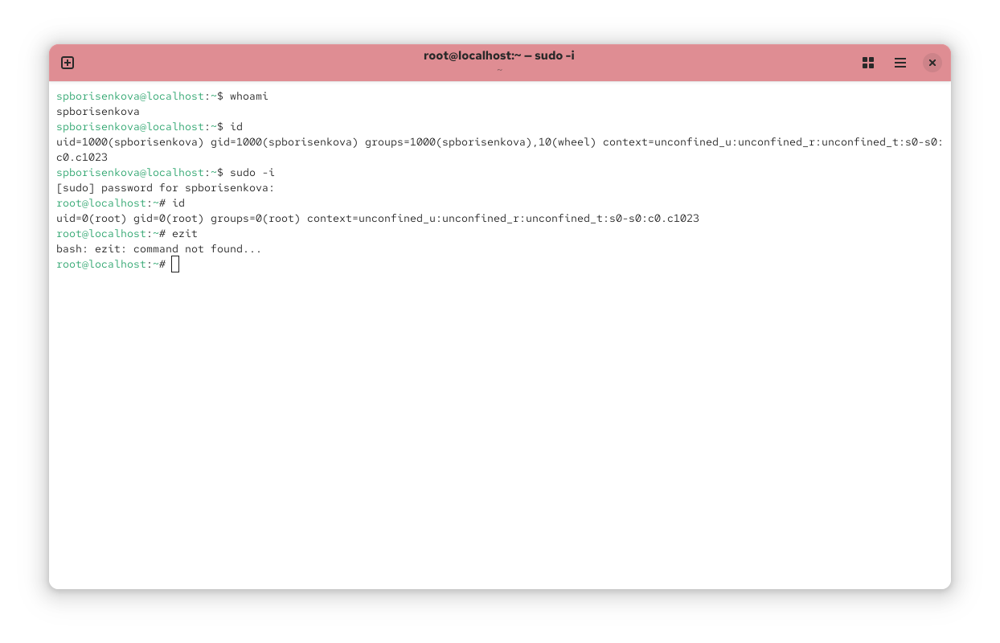
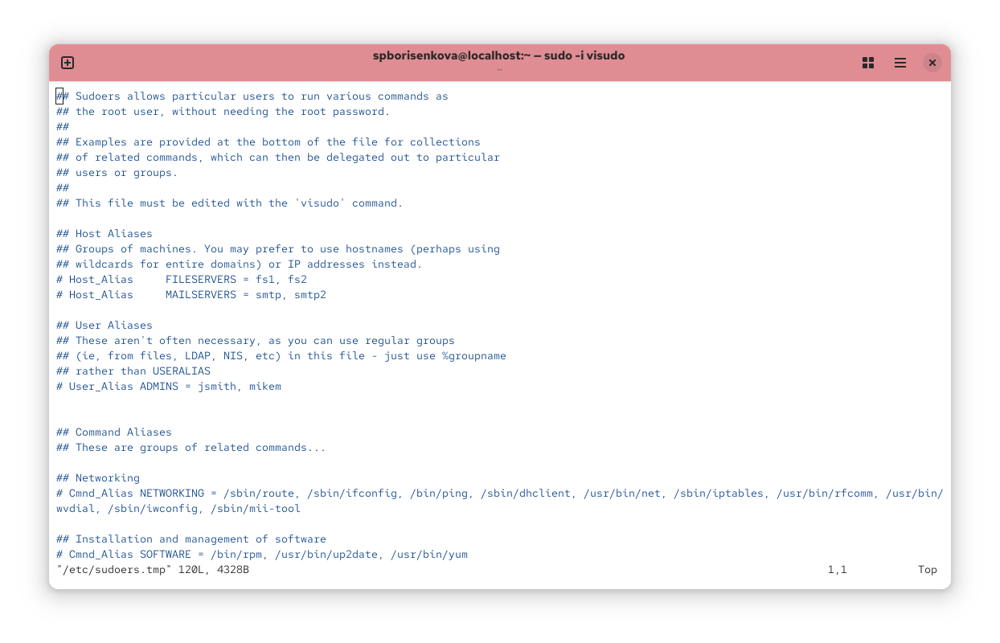
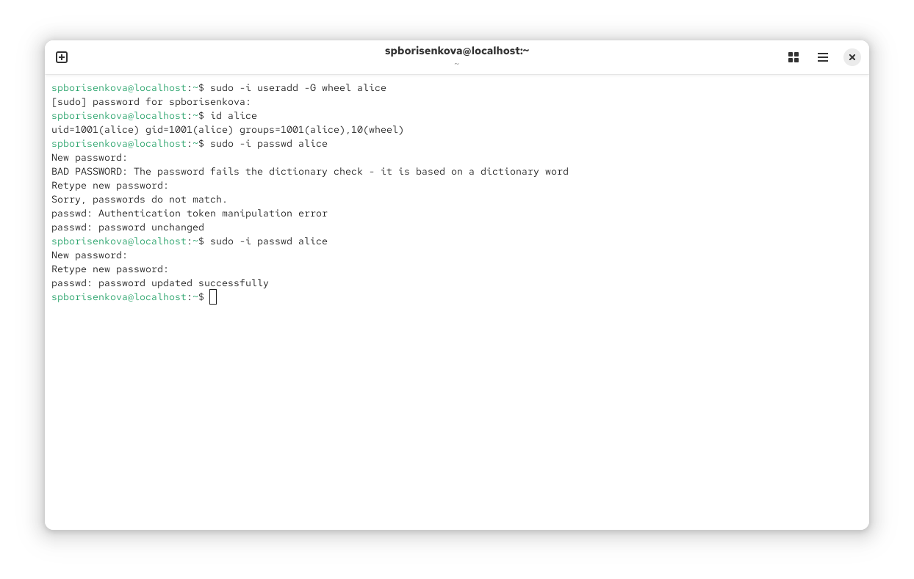
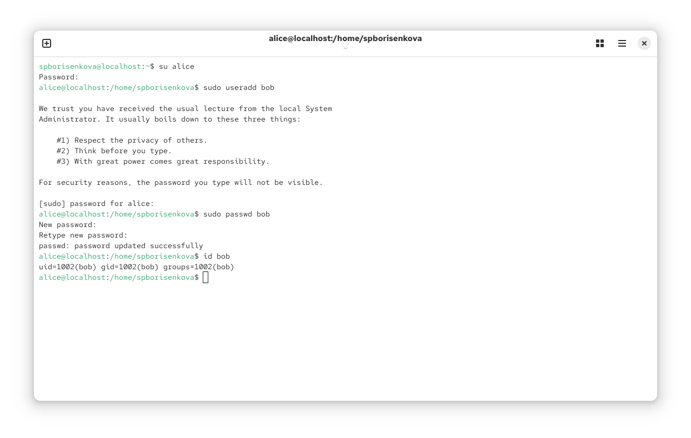
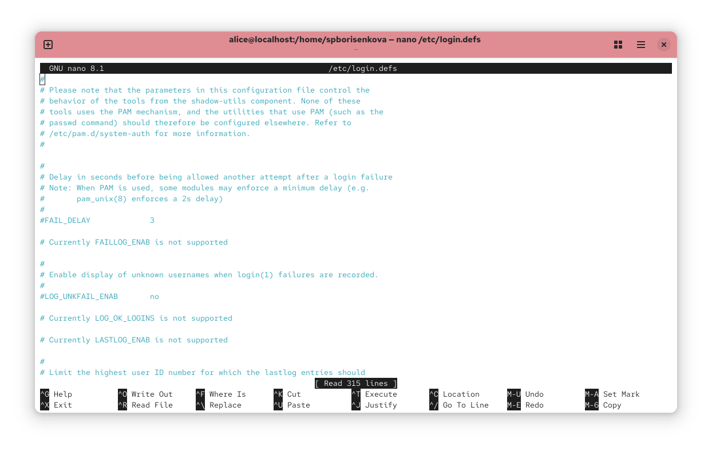
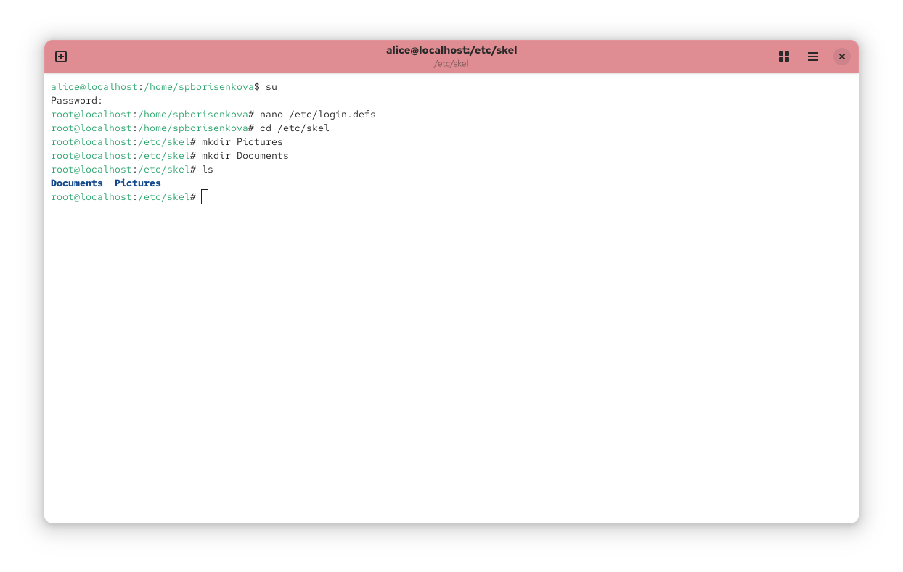
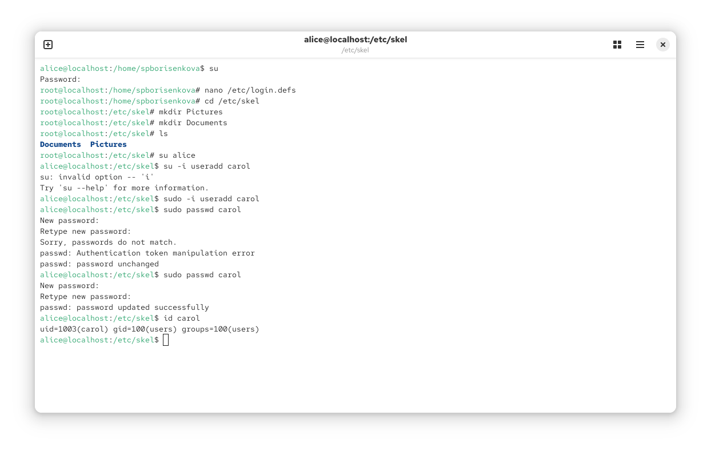

---
## Front matter
title: "Отчёт к лабораторной работе №3"
subtitle: "Основы администрирования операционных систем"
author: "Борисенкова София Павловна"

## Generic otions
lang: ru-RU
toc-title: "Содержание"

## Bibliography
bibliography: bib/cite.bib
csl: pandoc/csl/gost-r-7-0-5-2008-numeric.csl

## Pdf output format
toc: true # Table of contents
toc-depth: 2
lof: true # List of figures
lot: true # List of tables
fontsize: 12pt
linestretch: 1.5
papersize: a4
documentclass: scrreprt
## I18n polyglossia
polyglossia-lang:
  name: russian
  options:
	- spelling=modern
	- babelshorthands=true
polyglossia-otherlangs:
  name: english
## I18n babel
babel-lang: russian
babel-otherlangs: english
## Fonts
mainfont: IBM Plex Serif
romanfont: IBM Plex Serif
sansfont: IBM Plex Sans
monofont: IBM Plex Mono
mathfont: STIX Two Math
mainfontoptions: Ligatures=Common,Ligatures=TeX,Scale=0.94
romanfontoptions: Ligatures=Common,Ligatures=TeX,Scale=0.94
sansfontoptions: Ligatures=Common,Ligatures=TeX,Scale=MatchLowercase,Scale=0.94
monofontoptions: Scale=MatchLowercase,Scale=0.94,FakeStretch=0.9
mathfontoptions:
## Biblatex
biblatex: true
biblio-style: "gost-numeric"
biblatexoptions:
  - parentracker=true
  - backend=biber
  - hyperref=auto
  - language=auto
  - autolang=other*
  - citestyle=gost-numeric
## Pandoc-crossref LaTeX customization
figureTitle: "Рис."
tableTitle: "Таблица"
listingTitle: "Листинг"
lofTitle: "Список иллюстраций"
lotTitle: "Список таблиц"
lolTitle: "Листинги"
## Misc options
indent: true
header-includes:
  - \usepackage{indentfirst}
  - \usepackage{float} # keep figures where there are in the text
  - \floatplacement{figure}{H} # keep figures where there are in the text
---

# Цель работы

Целью данной работы является приобретение практических навыков работы с пользовательями в Rocky Linux.

# Последовательность выполнения работы

Открываем терминал с учётной записью root: su -. В корневом каталоге создаём каталоги /data/main и /data/third командой: mkdir -p /data/main /data/third. Посмотрим, кто является владельцем этих каталогов. Для этого используем: ls -Al /data. Владельцем каталогов является суперпользователь. Прежде чем устанавливать разрешения, изменим владельцев этих каталогов с root на main и third соответственно: chgrp main /data/main и chgrp third /data/third. Теперь владельцем этих каталогов является main и third. Далее установим разрешения, позволяющие владельцам каталогов записывать файлы в эти каталоги и запрещающие доступ к содержимому каталогов всем другим пользователям и группам: chmod 770 /data/main и chmod 770 /data/third. Проверим установленные права доступа

{#fig:001 width=70%}

В другом терминале перейдём под учётную запись пользователя bob: su – bob. Под пользователем bob попробуем перейти в каталог /data/main и создать файл emptyfile в этом каталоге: cd /data/main и touch emptyfile. Так как пользователь bob является владельцем каталога main, нам удалось перейти в этот каталог и создать в нём новый файл. Теперь под пользователем bob попробуем перейти в каталог /data/third и создать файл emptyfile в этом каталоге. Так как пользователь bob не является владельцем каталога third, нам не удалось перейти в этот каталог и создать в нём новый файл

{#fig:002 width=70%}

Откроем новый терминал под пользователем alice: su - alice. Перейдём в каталог /data/main: cd /data/main. В нём создадим два файла, владельцем которых является alice: touch alice1 и touch alice2. Командой ls проверим корректность выполнения предыдущей команды

{#fig:003 width=70%}

В другом терминале, под учётной записью пользователя bob (пользователь bob является членом группы main, как и alice) перейдём в каталог /data/main: cd /data/main (данный каталог уже был открыт в нашем терминале) и в этом каталоге введём: ls. Мы увидим два файла, созданные пользователем alice. Теперь попробуем удалить файлы, принадлежащие пользователю alice командой: rm -f alice*. Убедимся, что файлы будут удалены пользователем bob. После проверки командой ls создадим два файла, которые принадлежат пользователю bob: touch bob1 и touch bob2.

{#fig:004 width=70%}

Переходим в терминал под пользователем alice и создаём в каталоге /data/main файлы alice3 и alice4: touch alice3 и touch alice4. Теперь мы должны увидеть, что два созданных вами файла принадлежат группе main, которая является группой-владельцем каталога /data/main: ls и ls -Al /data. В этом же терминале попробуем удалить файлы, принадлежащие пользователю bob: rm -rf bob*. Убедимся, что sticky-bit предотвратит удаление этих файлов пользователем alice, поскольку этот пользователь не является владельцем этих файлов

{#fig:005 width=70%}

Откроем терминал с учётной записью root и установим права на чтение и выполнение в каталоге /data/main для группы third и права на чтение и выполнение для группы main в каталоге /data/third: setfacl -m g:third:rx /data/main и setfacl -m g:main:rx /data/third. Теперь используем команду getfacl, чтобы убедиться в правильности установки разрешений: getfacl /data/main и getfacl /data/third

{#fig:006 width=70%}

Далее создадим новый файл с именем newfile1 в каталоге /data/main: touch /data/main/newfile1. Используем getfacl /data/main/newfile1 для проверки текущих назначений полномочий. У пользователя только чтение и запись, у группы и других только чтение.

{#fig:007 width=70%}

Для проверки полномочий группы third в каталоге /data/third войдём в другом терминале под учётной записью члена группы third: su – carol и проверим операции с файлами: rm /data/main/newfile1 и rm /data/main/newfile2. Система не даёт удалить данные файлы. Теперь проверим, возможно ли осуществить запись в файл: 
echo "Hello, world" >> /data/main/newfile1 
echo "Hello, world" >> /data/main/newfile2 
В файл newfile1 запись осуществить не получилось, а вот в newfile2 всё выполнилось

# Контрольные вопросы

1. chown bob:main data/third/newfile
2. find ~ -user bob -print
3. chmod 770
4. chmod +x file
5. getfactl "name"
6. chmod g+s,o+t path
7. setfacl -m g:group:dir path
8. setfacl -dm g:group:r parh
9. 007
10. sudo chattr +i filename

# Вывод

В ходе работы были получены навыки обращения с пользователями и группами в Rocky Linux

