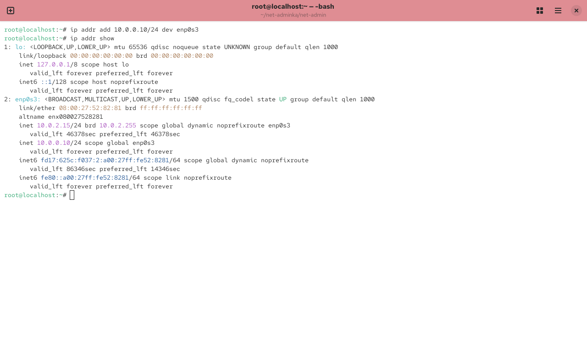
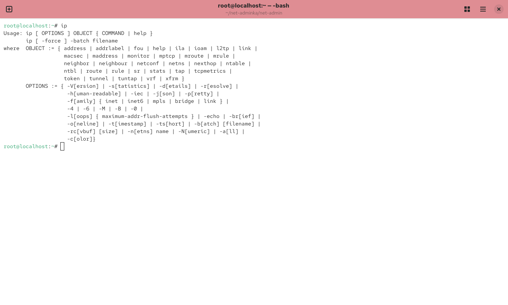
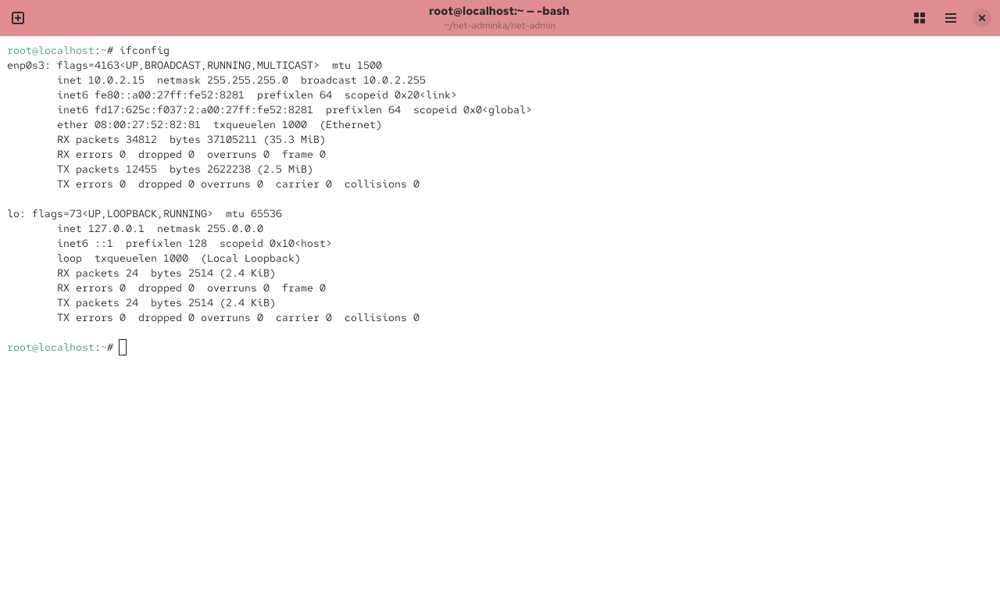
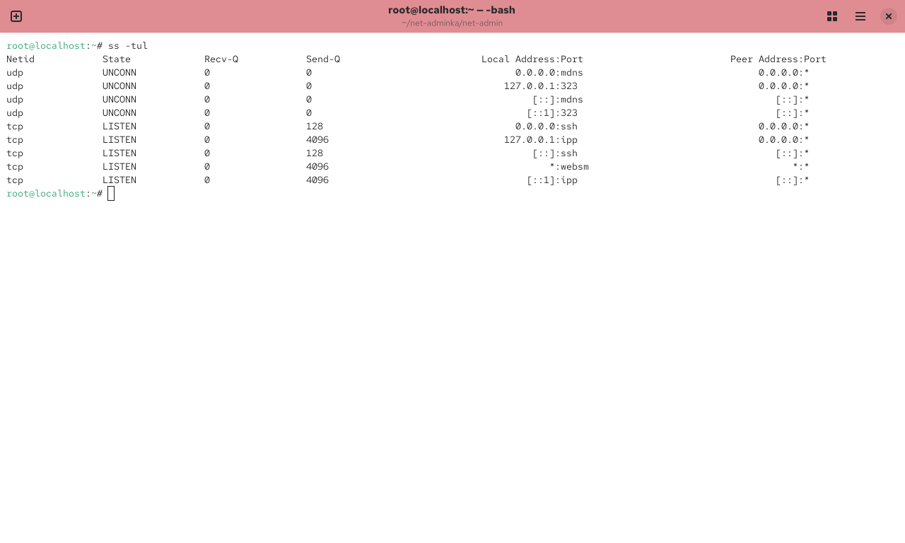
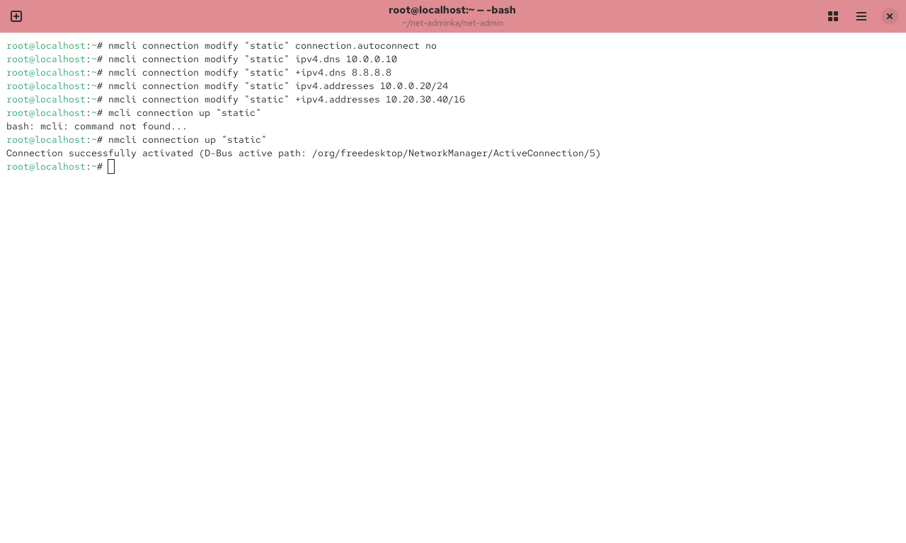
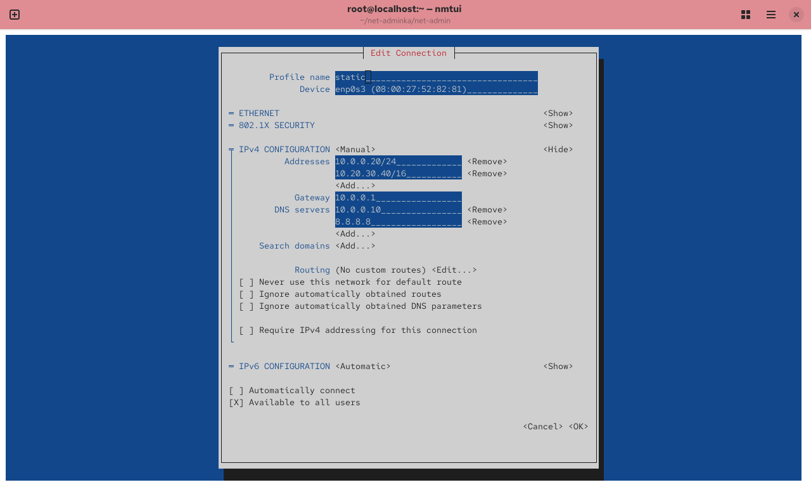
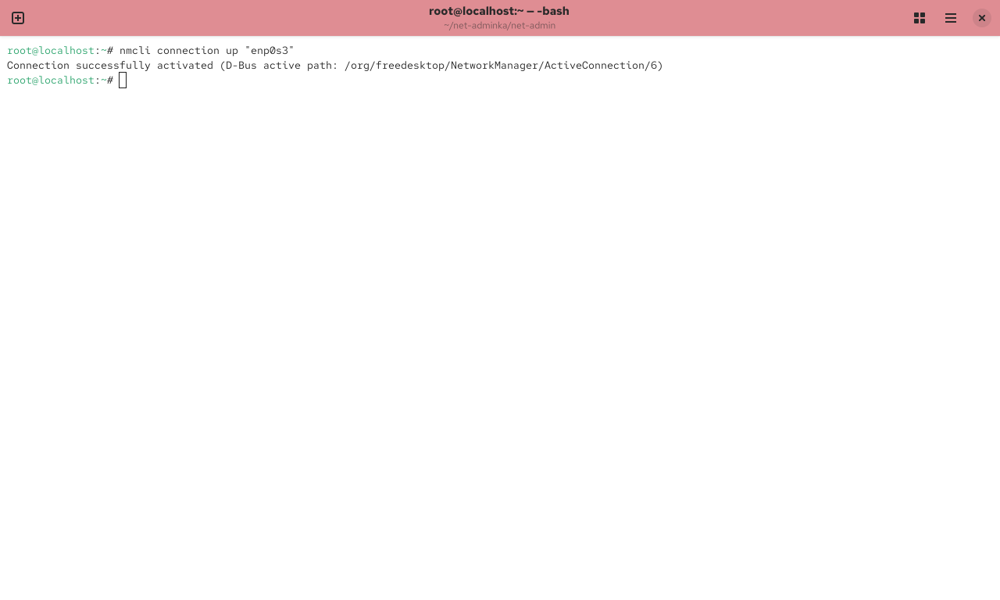

---
## Front matter
lang: ru-RU
title: Отчёт по лабораторной работе №12
subtitle: Управление сетями
author:
  - Борисенкова София Павловна
institute:
  - Российский университет дружбы народов, Москва, Россия
date: 13 ноября 2025

## i18n babel
babel-lang: russian
babel-otherlangs: english

## Formatting pdf
toc: false
slide_level: 2
aspectratio: 169
section-titles: true
theme: metropolis
header-includes:
 - \metroset{progressbar=frametitle,sectionpage=progressbar,numbering=fraction}
---

# Цель работы

## Цель
Получить навыки настройки сетей в Linux

# Выполнение лабораторной работы

##Сетевые подключения

{ width=70% }

## Отправка пакетов
{ width=70% }

## Дополнительный адрес
{ width=70% }

## Утилита ip
{ width=70% }

## ifconfig
{ width=70% }

## UDP & TCP
{ width=70% }

## Соединения
{ width=70% }

## Проверка переключения
{ width=70% }

## Соединение dhcp
{ width=70% }

## Статическое соединение
{ width=70% }

## Настройки сетевых соединений 
{ width=70% }

##Первоначальное сетевое соединение 
{ width=70% }

# Вывод
В ходе работы были изучены методы настройки сетей
