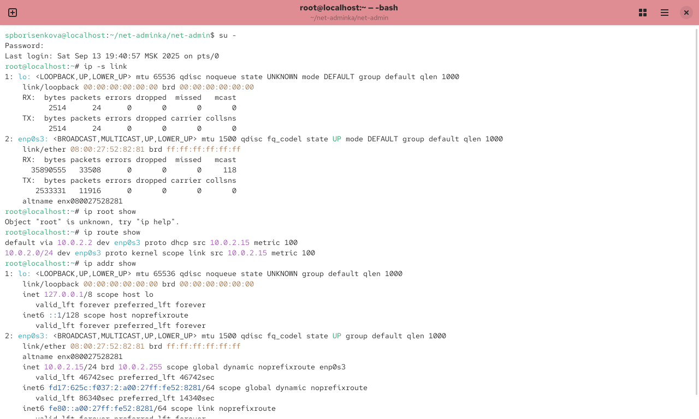
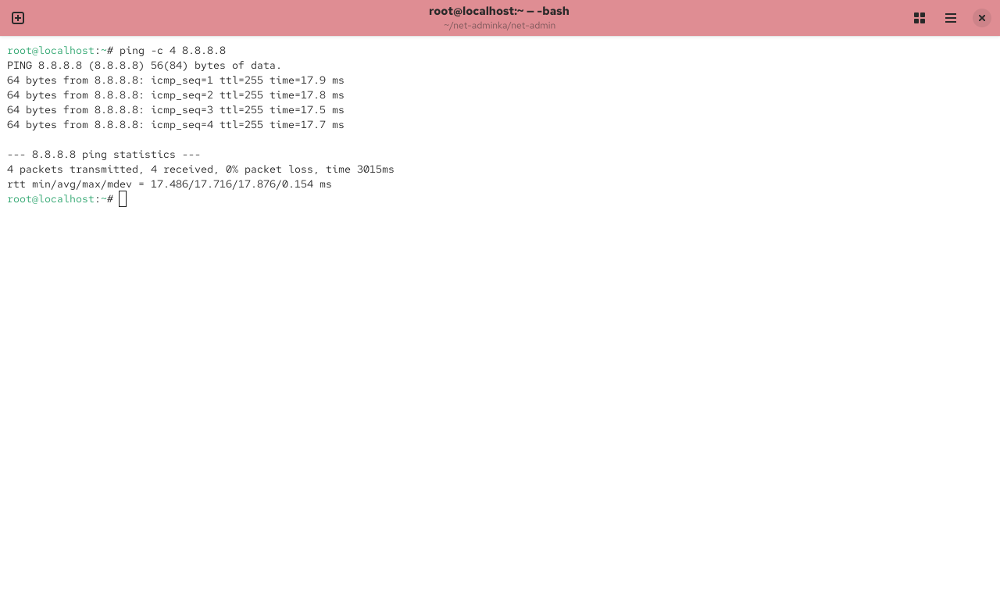
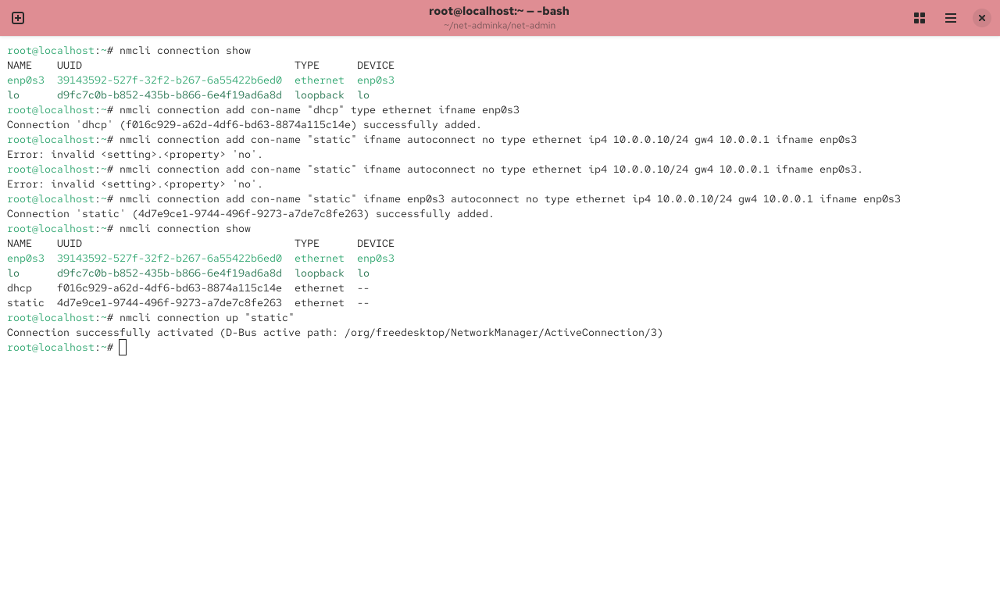
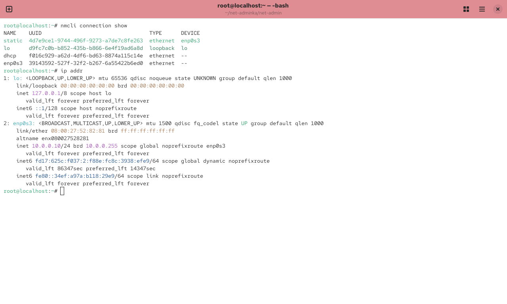
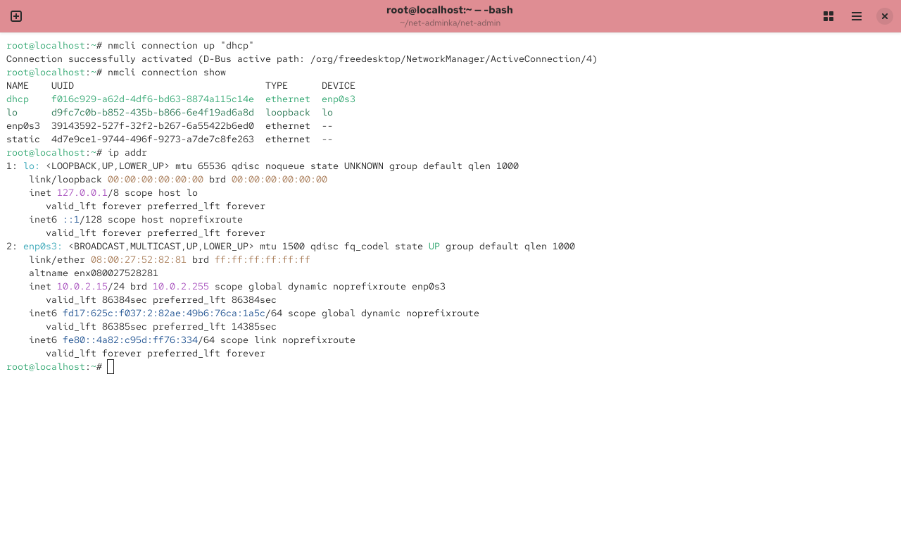

---
## Front matter
title: "Отчёт по лабораторной работе №12"
subtitle: "Настройки сети"
author: "Борисенкова София Павловна"

## Generic otions
lang: ru-RU
toc-title: "Содержание"

## Pdf output format
toc: true # Table of contents
toc-depth: 2
lof: true # List of figures
lot: true # List of tables
fontsize: 12pt
linestretch: 1.5
papersize: a
documentclass: scrreprt
## I18n polyglossia
polyglossia-lang:
  name: russian
  options:
	- spelling=modern
	- babelshorthands=true
polyglossia-otherlangs:
  name: english
## I18n babel
babel-lang: russian
babel-otherlangs: english
## Fonts
mainfont: IBM Plex Serif
romanfont: IBM Plex Serif
sansfont: IBM Plex Sans
monofont: IBM Plex Mono
mathfont: STIX Two Math
mainfontoptions: Ligatures=Common,Ligatures=TeX,Scale=0.94
romanfontoptions: Ligatures=Common,Ligatures=TeX,Scale=0.94
sansfontoptions: Ligatures=Common,Ligatures=TeX,Scale=MatchLowercase,Scale=0.94
monofontoptions: Scale=MatchLowercase,Scale=0.94,FakeStretch=0.9
mathfontoptions:
## Biblatex
biblatex: true
biblio-style: "gost-numeric"
biblatexoptions:
  - parentracker=true
  - backend=biber
  - hyperref=auto
  - language=auto
  - autolang=other*
  - citestyle=gost-numeric
## Pandoc-crossref LaTeX customization
figureTitle: "Рис."
tableTitle: "Таблица"
listingTitle: "Листинг"
lofTitle: "Список иллюстраций"
lotTitle: "Список таблиц"
lolTitle: "Листинги"
## Misc options
indent: true
header-includes:
  - \usepackage{indentfirst}
  - \usepackage{float} # keep figures where there are in the text
  - \floatplacement{figure}{H} # keep figures where there are in the text
---

# Цель работы

Целью данной работы является получение навыков настройки сетевых параметров системы.

# Выполнение лабораторной работы

Получим полномочия администратора: su -. Выведем на экран информацию о существующих сетевых подключениях, а также статистику о количестве отправленных пакетов и связанных с ними сообщениях об ошибках: ip -s link и информацию о текущих маршрутах: ip route show. После чего информацию о текущих назначениях адресов для сетевых интерфейсов на устройстве: ip addr show [@fig:001]:

{ #fig:001 width=70% }

Используем команду ping для проверки правильности подключения к Интернету. Например, для отправки четырёх пакетов на IP-адрес 8.8.8.8 введём ping -c 4 8.8.8.8 [@fig:002].

{ #fig:002 width=70% }

Добавим дополнительный адрес к нашему интерфейсу: ip addr add 10.0.0.10/24 dev enp0s3 (enp0s3 — название интерфейса, которому добавляется IP-адрес). Проверим, что адрес добавился: ip addr show [@fig:003]

{ #fig:003 width=70% }

Сравним вывод информации от утилиты ip и от команды ifconfig.

{ #fig:004 width=70% }
{ #fig:005 width=70% }

Выведем на экран список всех прослушиваемых системой портов UDP и TCP: ss -tul 

{ #fig:006 width=70% }

Выведем на экран информацию о текущих соединениях: nmcli connection show и добавим Ethernet-соединение с именем dhcp к интерфейсу: nmcli connection add con-name "dhcp" type ethernet ifname enp0s3 (enp0s3 — название интерфейса). Далее добавим к этому же интерфейсу Ethernet-соединение с именем static, статическим IPv4-адресом адаптера и статическим адресом шлюза: nmcli connection add con-name "static" ifname autoconnect no type ethernet ip4 10.0.0.10/24 gw4 10.0.0.1 ifname enp0s3. Выведем информацию о текущих соединениях: nmcli connection show и переключимся на статическое соединение: nmcli connection up "static"

{ #fig:007 width=70% }

Проверим успешность переключения при помощи nmcli connection show и ip addr

{ #fig:008 width=70% }

Вернёмся к соединению dhcp: nmcli connection up "dhcp" и проверм успешность переключения при помощи nmcli connection show и ip addr

{ #fig:009 width=70% }

Отключим автоподключение статического соединения: nmcli connection modify "static" connection.autoconnect no и добавим DNS-сервер в статическое соединение: nmcli connection modify "static" ipv4.dns 10.0.0.10 (обратим внимание, что при добавлении сетевого подключения используется ip4, а при изменении параметров для существующего соединения используется ipv4). Для добавления второго и последующих элементов для тех же параметров используется знак +. Если этот знак проигнорировать, то произойдёт замена, а не добавление элемента. Добавим второй DNS-сервер: nmcli connection modify "static" +ipv4.dns 8.8.8.8. После чего изменим IP-адрес статического соединения: nmcli connection modify "static" ipv4.addresses 10.0.0.20/24 и сразу же добавим другой IP-адрес для статического соединения: nmcli connection modify "static" +ipv4.addresses 10.20.30.40/16. После изменения свойств соединения, активируем его: nmcli connection up "static"

{ #fig:010 width=70% }

Используя nmtui, посмотрим настройки сети на устройстве 

{ #fig:011 width=70% }

Переключимся на первоначальное сетевое соединение: nmcli connection up "enp0s3"

{ #fig:012 width=70% }

# Контрольные вопросы

1. ip link 

2. NetworkManager 

3. /etc/hostname

4. hostamectl set-hostname

5. /etc/hosts

6. ip route show

7. systemctl status NetworkManager

8. nmcli con mod <имя соединения> ipv4.addresses "<текущий ip>,<новый ip>'' gw4 <новый ip> - изменить текущий ip адрес и шлюз.

#Вывод

В ходе выполнения лабораторной работы были получены навыки настройки сетевых параметров системы.
