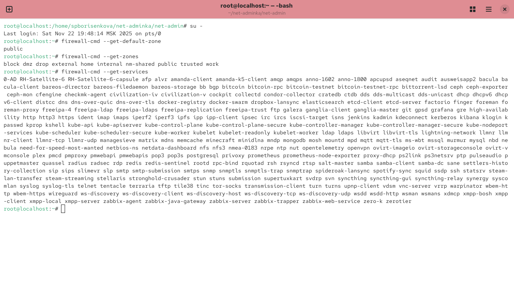
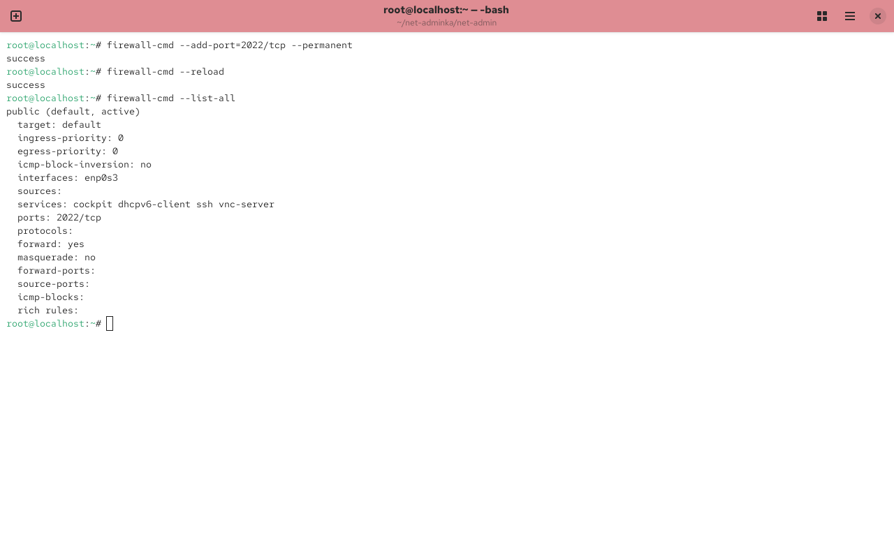
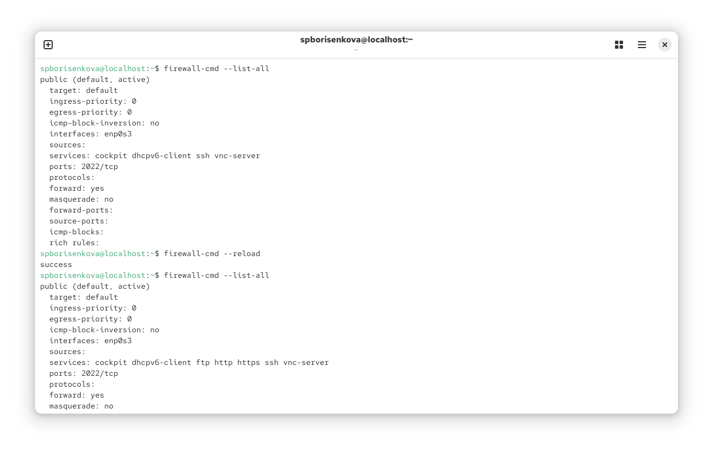

---
## Front matter
lang: ru-RU
title: Отчёт по лабораторной работе №13
subtitle: Фильтр пакетов
author:
  - Борисенкова София Павловна
institute:
  - Российский университет дружбы народов, Москва, Россия
date: 27 ноября 2025

## i18n babel
babel-lang: russian
babel-otherlangs: english

## Formatting pdf
toc: false
slide_level: 2
aspectratio: 169
section-titles: true
theme: metropolis
header-includes:
 - \metroset{progressbar=frametitle,sectionpage=progressbar,numbering=fraction}
---

# Цель работы

## Цель

Получить навыки настройки пакетного фильтра и управления брандмауэром в Linux.

# Выполнение лабораторной работы

## Получение привилегий

{ #fig:001 width=70% }

## Просмотр зон и служб

{ #fig:002 width=70% }

## Добавление службы vnc-server

{ #fig:003 width=70% }

## Добавление порта 2022/tcp

{ #fig:006 width=70% }

## Запуск firewall-config

{ #fig:007 width=70% }

## Применение GUI-настроек

{ #fig:009 width=70% }

## Включение imap

{ #fig:010 width=70% }
## Включение pop3

{ #fig:010 width=70% }

## Включение smtp

{ #fig:010 width=70% }

# Итоги работы

## Вывод

* Изучены механизмы управления firewall через firewall-cmd
* Получены навыки работы с временной и постоянной конфигурацией.
* Освоено добавление служб и портов.
* Применены команды и GUI-инструменты 
* Понято различие между runtime и permanent конфигурациями.
