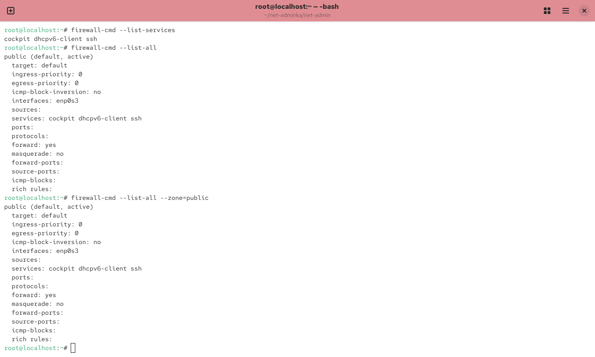
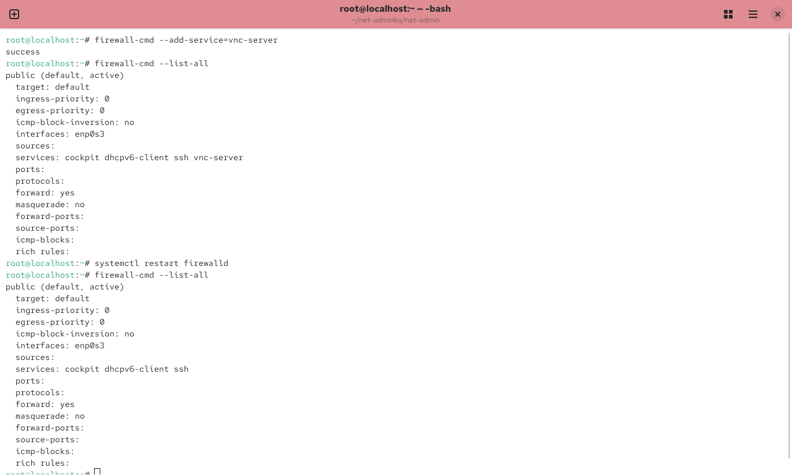
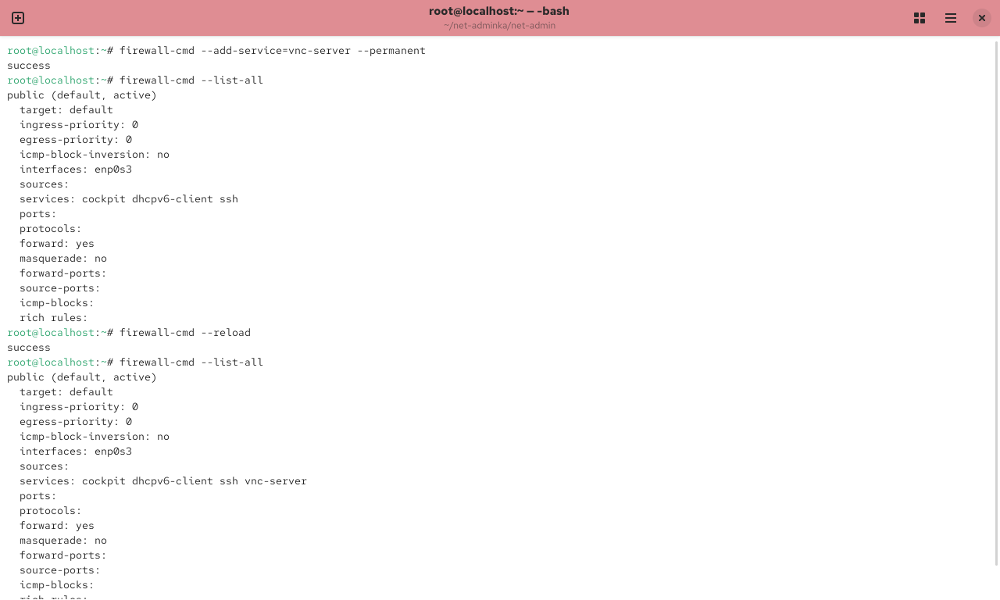
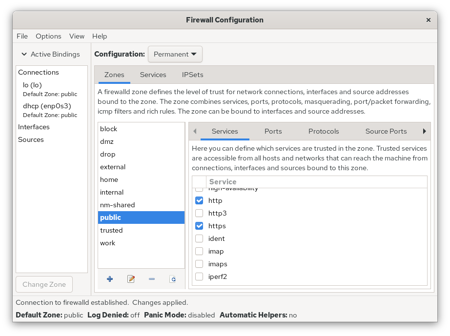
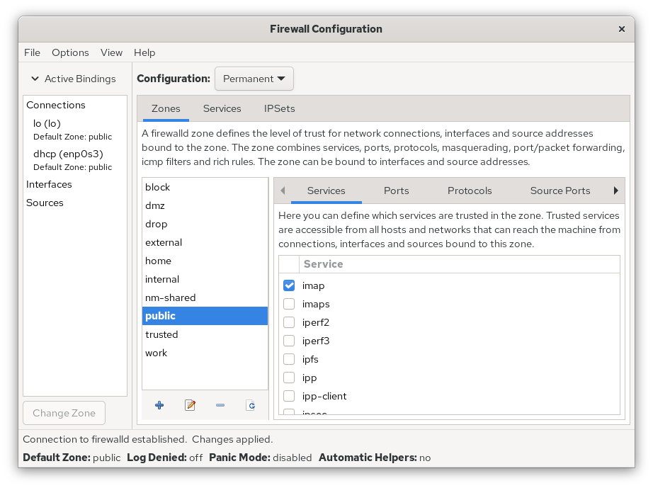
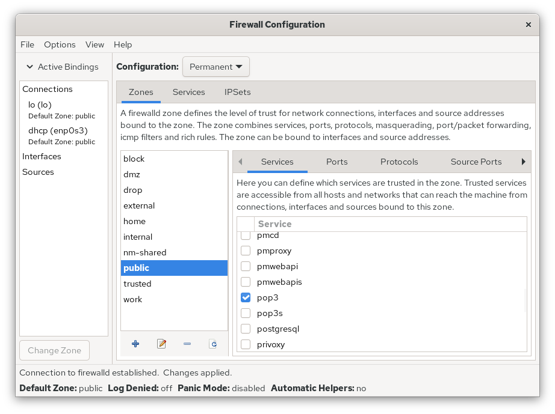

---
## Front matter
title: "Отчёт по лабораторной работе №13"
subtitle: "Фильтр пакетов"
author: "Борисенкова София Павловна"

## Generic otions
lang: ru-RU
toc-title: "Содержание"

## Pdf output format
toc: true # Table of contents
toc-depth: 2
lof: true # List of figures
lot: true # List of tables
fontsize: 12pt
linestretch: 1.5
papersize: a
documentclass: scrreprt
## I18n polyglossia
polyglossia-lang:
  name: russian
  options:
	- spelling=modern
	- babelshorthands=true
polyglossia-otherlangs:
  name: english
## I18n babel
babel-lang: russian
babel-otherlangs: english
## Fonts
mainfont: IBM Plex Serif
romanfont: IBM Plex Serif
sansfont: IBM Plex Sans
monofont: IBM Plex Mono
mathfont: STIX Two Math
mainfontoptions: Ligatures=Common,Ligatures=TeX,Scale=0.94
romanfontoptions: Ligatures=Common,Ligatures=TeX,Scale=0.94
sansfontoptions: Ligatures=Common,Ligatures=TeX,Scale=MatchLowercase,Scale=0.94
monofontoptions: Scale=MatchLowercase,Scale=0.94,FakeStretch=0.9
mathfontoptions:
## Biblatex
biblatex: true
biblio-style: "gost-numeric"
biblatexoptions:
  - parentracker=true
  - backend=biber
  - hyperref=auto
  - language=auto
  - autolang=other*
  - citestyle=gost-numeric
## Pandoc-crossref LaTeX customization
figureTitle: "Рис."
tableTitle: "Таблица"
listingTitle: "Листинг"
lofTitle: "Список иллюстраций"
lotTitle: "Список таблиц"
lolTitle: "Листинги"
## Misc options
indent: true
header-includes:
  - \usepackage{indentfirst}
  - \usepackage{float} # keep figures where there are in the text
  - \floatplacement{figure}{H} # keep figures where there are in the text
---

# Цель работы

Получить навыки настройки пакетного фильтра в Linux.

# Выполнение лабораторной работы

Получаю привилегии администратора,определяю зону по умолчанию и просматриваю доступные зоны (см. рис. [@fig:001]).

{ #fig:001 width=70% }

Определяю службы, доступные в текущей зоне. Сравниваю вывод команд `firewall-cmd --list-all` и `firewall-cmd --list-all --zone=public` (см. рис. [@fig:002]).

{ #fig:002 width=70% }

Добавляю службу vnc-server в конфигурацию брандмауэра и проверяю, что служба добавлена: (см. рис. [@fig:003]).

Перезапускаю службу `firewalld` командой `systemctl restart firewalld`, затем снова просматриваю конфигурацию — служба vnc-server исчезает, поскольку ранее была добавлена только во время выполнения 

Добавляю службу vnc-server на постоянной основе командой `firewall-cmd --add-service=vnc-server --permanent`.
Проверяю конфигурацию — служба не отображается, так как изменения постоянной конфигурации не активируются автоматически 

Перезагружаю конфигурацию `firewall-cmd --reload` и снова просматриваю параметры зоны — служба vnc-server появляется 

{ #fig:003 width=70% }

Добавляю порт 2022/tcp в постоянную конфигурацию и после перезагрузки убеждаюсь, что порт добавлен (см. рис. [@fig:006]).

{ #fig:006 width=70% }

Запускаю графическую утилиту `firewall-config` (см. рис. [@fig:005]).  
В меню Configuration выбираю Permanent.

Перехожу в зону public и включаю службы http, https и ftp (см. рис. [@fig:007]).

{ #fig:007 width=70% }

На вкладке Ports нажимаю Add и добавляю порт 2022/udp

Проверяю конфигурацию `firewall-cmd --list-all` — изменения не вступили в силу, так как были добавлены только в постоянный профиль.

Перезагружаю конфигурацию `firewall-cmd --reload` и снова просматриваю настройки — изменения применены (см. рис. [@fig:006]).

{ #fig:009 width=70% }

Создаю конфигурацию межсетевого экрана, позволяющую доступ к службам **telnet**, **imap**, **pop3** и **smtp**.

Открываю утилиту `firewall-config` и перехожу в режим **Permanent**.  
Выбираю зону **public** и отмечаю службы **imap**, **pop3** и **smtp** в списке (см. рис. [@fig:010]).

{ #fig:010 width=70% }
{ #fig:010 width=70% }
{ #fig:010 width=70% }

Добавляю службу **telnet** через командную строку, используя постоянное добавление, чтобы правило сохранилось на диске и применялось после перезагрузки 

После внесения изменений проверяю конфигурацию в терминале.  
Службы **telnet**, **imap**, **pop3** и **smtp** присутствуют в списке и отмечены как активные и постоянные, что подтверждает корректное применение настроек после перезагрузки системы 

# Контрольные вопросы

1. Должна быть запущена служба firewalld.

2. firewall-cmd --add-port=2355/udp --permanent

3. firewall-cmd --list-all-zones

4. firewall-cmd --remove-service=vnc-server

5. firewall-cmd --reload

6. firewall-cmd --list-all

7. firewall-cmd --zone=public --add-interface=eno1 --permanent

8. В зону по умолчанию 

# Заключение

В ходе лабораторной работы были освоены приёмы управления брандмауэром в Linux 
